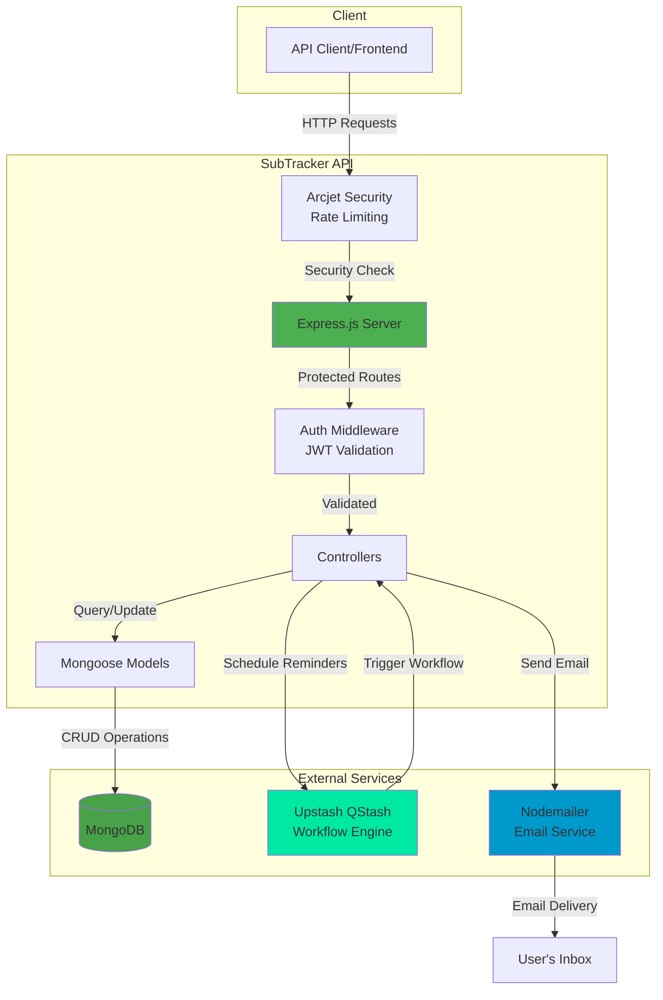
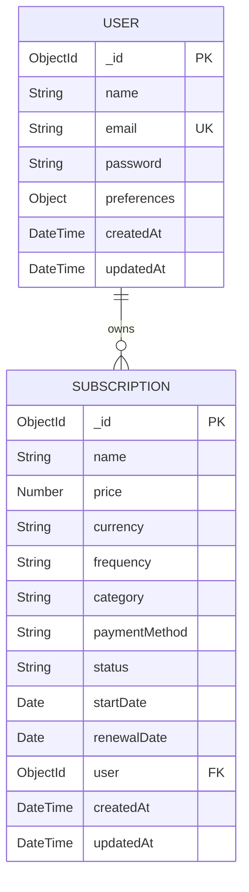

# SubTracker - Subscription Management API

A backend API for tracking recurring subscriptions with automated email reminders before renewals.

## Features

-   **Authentication System**: JWT-based authentication with login, register, and token refresh
-   **Subscription Management**: CRUD operations for managing subscription details
-   **Automated Reminders**: Time-based email notifications before subscription renewals
-   **User Profiles**: User management with personalized preferences
-   **Payment Methods**: Track different payment methods used for subscriptions
-   **Currency Support**: Multi-currency support (SAR, USD, EUR)
-   **Security**: Arcjet integration for API protection

## Technology Stack

-   **Runtime**: Node.js v22+
-   **Framework**: Express.js v4
-   **Database**: MongoDB with Mongoose v8
-   **Authentication**: JWT with bcryptjs
-   **Email Service**: Nodemailer
-   **Workflow Automation**: Upstash QStash and Workflow
-   **Date Manipulation**: Day.js
-   **Security**: Arcjet for rate limiting and bot protection

## System Architecture



[View detailed architecture diagrams →](docs/architecture.md)

## Project Structure

```
subscription-tracker/
├── app.js                  # Main application entry point
├── config/                 # Configuration files
│   ├── env.js              # Environment variables
│   ├── nodemailer.js       # Email service configuration
│   └── upstash.js          # Upstash workflow configuration
├── controllers/            # Request handlers
│   ├── auth.controller.js  # Authentication operations
│   ├── subscription.controller.js # Subscription operations
│   ├── user.controller.js  # User profile operations
│   └── workflow.controller.js # Reminder workflow management
├── database/
│   └── mongodb.js          # MongoDB connection setup
├── middlewares/            # Express middlewares
│   ├── arcjet.middleware.js # Security middleware
│   ├── auth.middleware.js  # JWT validation
│   └── error.middleware.js # Error handling
├── models/                 # Mongoose data models
│   ├── subscription.model.js # Subscription schema
│   └── user.model.js       # User schema
├── routes/                 # API route definitions
│   ├── auth.routes.js      # Authentication endpoints
│   ├── subscription.routes.js # Subscription endpoints
│   ├── user.routes.js      # User profile endpoints
│   └── workflow.routes.js  # Workflow trigger endpoints
├── utils/                  # Helper utilities
│   ├── email-template.js   # Email template generator
│   └── send-email.js       # Email sending utility
└── package.json            # Project dependencies
```

## API Endpoints

> Note: Endpoints marked with "(placeholder)" are not fully implemented yet.

### Authentication

-   `POST /api/v1/auth/sign-up` - Create a new user account
-   `POST /api/v1/auth/sign-in` - Authenticate and get access token
-   `POST /api/v1/auth/sign-out` - Invalidate current token and logout

### User Management

-   `GET /api/v1/users` - Get all users (admin only)
-   `GET /api/v1/users/:id` - Get user by ID (requires authentication)
-   `POST /api/v1/users` - Create a new user (placeholder)
-   `PUT /api/v1/users/:id` - Update user (placeholder)
-   `DELETE /api/v1/users/:id` - Delete user (placeholder)

### Subscription Management

-   `GET /api/v1/subscriptions` - List all subscriptions (placeholder)
-   `POST /api/v1/subscriptions` - Create new subscription (requires authentication)
-   `GET /api/v1/subscriptions/:id` - Get subscription details (placeholder)
-   `DELETE /api/v1/subscriptions/:id` - Delete subscription (placeholder)
-   `GET /api/v1/subscriptions/user/:id` - Get all subscriptions for a user (placeholder)
-   `PUT /api/v1/subscriptions/:id/cancel` - Cancel a subscription (placeholder)
-   `GET /api/v1/subscriptions/upcoming-renewals` - Get upcoming renewals (placeholder)

### Workflow Management

-   `POST /api/v1/workflows` - Trigger workflow operations

## Data Models



[View detailed schema documentation →](docs/database-schema.md)

## Automated Reminder System

The reminder system sends emails to users before their subscriptions renew at the following intervals:

-   7 days before renewal
-   5 days before renewal
-   2 days before renewal
-   1 day before renewal
-   On the day of renewal

Reminders are scheduled using Upstash QStash and sent via Nodemailer with HTML email templates.
## Email Template


## Security Features

-   JWT-based authentication with refresh tokens
-   Password hashing with bcryptjs
-   API rate limiting with Arcjet
-   Input validation and sanitization
-   Proper error handling and logging

## Environment Variables

```
# Server
PORT=5500
NODE_ENV=development

# MongoDB
MONGODB_URI=mongodb://localhost:27017/subscription-tracker

# JWT
JWT_SECRET=your-jwt-secret
JWT_EXPIRY=30m
REFRESH_TOKEN_SECRET=your-refresh-token-secret
REFRESH_TOKEN_EXPIRY=7d

# Upstash QStash
QSTASH_TOKEN=your-qstash-token
QSTASH_CURRENT_SIGNING_KEY=your-current-signing-key
QSTASH_NEXT_SIGNING_KEY=your-next-signing-key
WORKFLOW_API_URL=your-workflow-api-url

# Email Service
EMAIL_SERVICE=gmail
EMAIL_USER=your-email@example.com
EMAIL_PASS=your-email-password
EMAIL_FROM=noreply@subtracker.com

# Arcjet Security
ARCJET_KEY=your-arcjet-key
```

## Getting Started

1. Clone the repository
2. Install dependencies: `npm install`
3. Set up environment variables in `.env` file
4. Start the development server: `npm run dev`
5. The API will be available at `http://localhost:5500`

## License

This project is licensed under the MIT License - see the LICENSE file for details.
