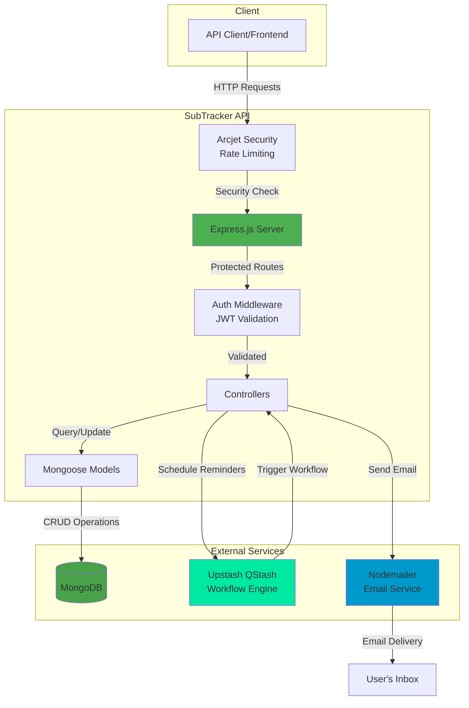
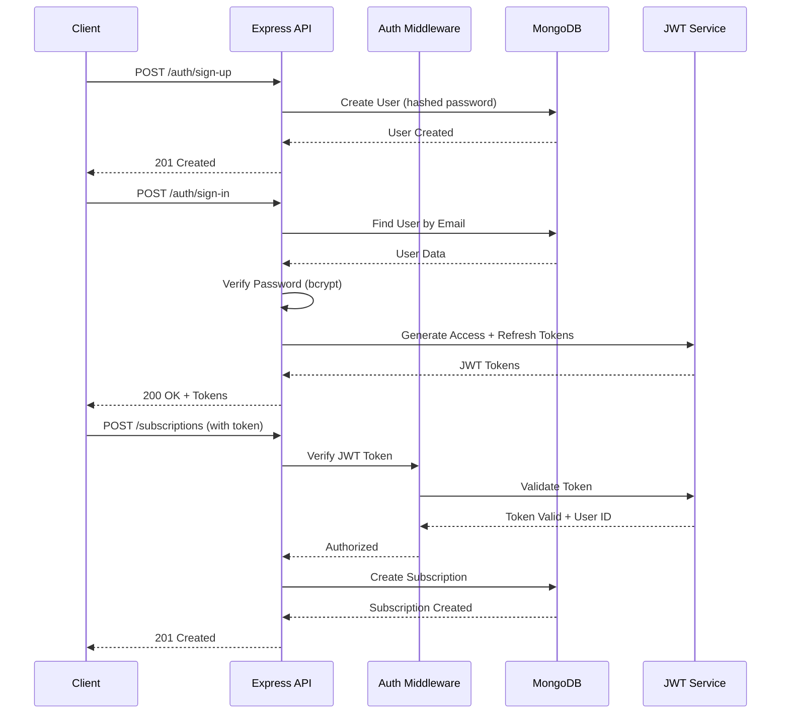
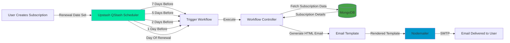
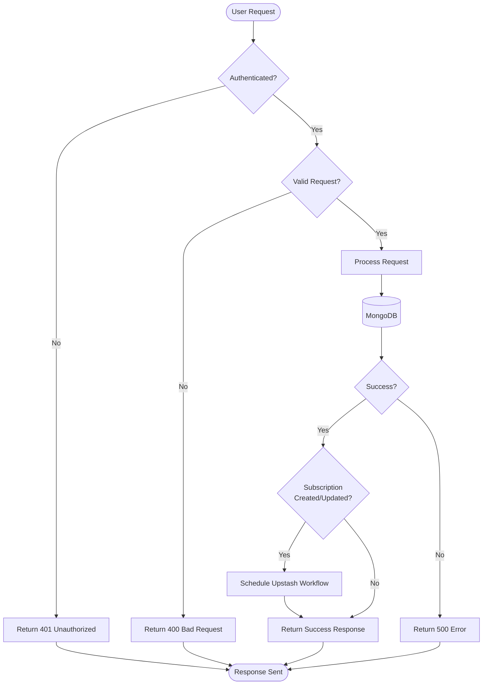

# SubTracker Architecture

## System Architecture Diagram

```mermaid
graph TB
    subgraph Client
        A[API Client/Frontend]
    end

    subgraph "SubTracker API"
        B[Express.js Server]
        C[Auth Middleware<br/>JWT Validation]
        D[Arcjet Security<br/>Rate Limiting]
        E[Controllers]
        F[Mongoose Models]
    end

    subgraph "External Services"
        G[(MongoDB)]
        H[Upstash QStash<br/>Workflow Engine]
        I[Nodemailer<br/>Email Service]
    end

    A -->|HTTP Requests| D
    D -->|Security Check| B
    B -->|Protected Routes| C
    C -->|Validated| E
    E -->|Query/Update| F
    F -->|CRUD Operations| G
    E -->|Schedule Reminders| H
    H -->|Trigger Workflow| E
    E -->|Send Email| I
    I -->|Email Delivery| J[User's Inbox]

    style B fill:#4CAF50
    style G fill:#47A248
    style H fill:#00E9A3
    style I fill:#0099CC
```

## Authentication Flow

```mermaid
sequenceDiagram
    participant C as Client
    participant API as Express API
    participant Auth as Auth Middleware
    participant DB as MongoDB
    participant JWT as JWT Service

    C->>API: POST /auth/sign-up
    API->>DB: Create User (hashed password)
    DB-->>API: User Created
    API-->>C: 201 Created

    C->>API: POST /auth/sign-in
    API->>DB: Find User by Email
    DB-->>API: User Data
    API->>API: Verify Password (bcrypt)
    API->>JWT: Generate Access + Refresh Tokens
    JWT-->>API: JWT Tokens
    API-->>C: 200 OK + Tokens

    C->>API: POST /subscriptions (with token)
    API->>Auth: Verify JWT Token
    Auth->>JWT: Validate Token
    JWT-->>Auth: Token Valid + User ID
    Auth-->>API: Authorized
    API->>DB: Create Subscription
    DB-->>API: Subscription Created
    API-->>C: 201 Created
```

## Reminder Workflow System

```mermaid
graph LR
    A[User Creates Subscription] -->|Renewal Date Set| B[Upstash QStash Scheduler]
    B -->|7 Days Before| C[Trigger Workflow]
    B -->|5 Days Before| C
    B -->|2 Days Before| C
    B -->|1 Day Before| C
    B -->|Day Of Renewal| C
    C -->|Execute| D[Workflow Controller]
    D -->|Fetch Subscription Data| E[(MongoDB)]
    E -->|Subscription Details| D
    D -->|Generate HTML Email| F[Email Template]
    F -->|Rendered Template| G[Nodemailer]
    G -->|SMTP| H[Email Delivered to User]

    style B fill:#00E9A3
    style G fill:#0099CC
    style E fill:#47A248
```

## Data Flow

```mermaid
flowchart TD
    Start([User Request]) --> Auth{Authenticated?}
    Auth -->|No| Login[Return 401 Unauthorized]
    Auth -->|Yes| Valid{Valid Request?}
    Valid -->|No| Error[Return 400 Bad Request]
    Valid -->|Yes| Process[Process Request]
    Process --> DB[(MongoDB)]
    DB --> Response{Success?}
    Response -->|Yes| Schedule{Subscription<br/>Created/Updated?}
    Response -->|No| DBError[Return 500 Error]
    Schedule -->|Yes| Workflow[Schedule Upstash Workflow]
    Schedule -->|No| Success[Return Success Response]
    Workflow --> Success
    Success --> End([Response Sent])
    Login --> End
    Error --> End
    DBError --> End
```
