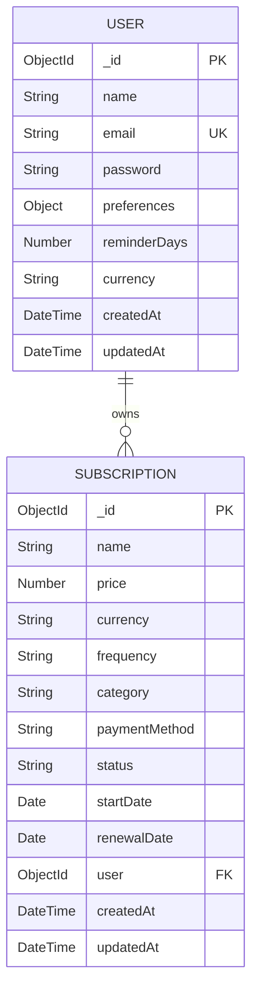

# Database Schema

## Entity Relationship Diagram



## Schema Details

### User Schema

| Field | Type | Description | Constraints |
|-------|------|-------------|-------------|
| `_id` | ObjectId | Primary key | Auto-generated |
| `name` | String | User's full name | Required |
| `email` | String | User's email address | Required, Unique, Validated |
| `password` | String | Hashed password | Required, Min 6 chars, Hashed with bcrypt |
| `preferences.reminderDays` | Array[Number] | Days before renewal to send reminders | Default: [7, 5, 2, 1, 0] |
| `preferences.currency` | String | Preferred currency | Enum: ['SAR', 'USD', 'EUR'] |
| `createdAt` | DateTime | Account creation timestamp | Auto-generated |
| `updatedAt` | DateTime | Last update timestamp | Auto-generated |

**Indexes:**
- `email`: Unique index for fast lookups
- `createdAt`: Index for sorting/filtering

---

### Subscription Schema

| Field | Type | Description | Constraints |
|-------|------|-------------|-------------|
| `_id` | ObjectId | Primary key | Auto-generated |
| `name` | String | Service name (e.g., "Netflix") | Required |
| `price` | Number | Subscription cost | Required, Min: 0 |
| `currency` | String | Currency code | Required, Enum: ['SAR', 'USD', 'EUR'] |
| `frequency` | String | Billing frequency | Required, Enum: ['daily', 'weekly', 'monthly', 'yearly'] |
| `category` | String | Subscription category | Enum: ['Food', 'Entertainment', 'Utilities', 'Health'] |
| `paymentMethod` | String | Payment method used | e.g., "Credit Card", "PayPal" |
| `status` | String | Current subscription status | Default: 'active', Enum: ['active', 'inactive', 'cancelled', 'pending'] |
| `startDate` | Date | Subscription start date | Required |
| `renewalDate` | Date | Next renewal date | Required |
| `user` | ObjectId | Reference to User | Required, Foreign Key |
| `createdAt` | DateTime | Record creation timestamp | Auto-generated |
| `updatedAt` | DateTime | Last update timestamp | Auto-generated |

**Indexes:**
- `user`: Index for filtering by user
- `renewalDate`: Index for reminder scheduling queries
- `status`: Index for filtering active subscriptions
- Compound index: `(user, status)` for user's active subscriptions

**Relationships:**
- `user` → References `User._id` (Many-to-One)
- Cascading: When user is deleted, their subscriptions should be deleted (application-level)

---

## Sample Data

### User Document
```json
{
  "_id": "507f1f77bcf86cd799439011",
  "name": "John Doe",
  "email": "john@example.com",
  "password": "$2a$10$XQF3hT.../...",
  "preferences": {
    "reminderDays": [7, 5, 2, 1, 0],
    "currency": "USD"
  },
  "createdAt": "2024-01-15T08:30:00.000Z",
  "updatedAt": "2024-01-15T08:30:00.000Z"
}
```

### Subscription Document
```json
{
  "_id": "507f1f77bcf86cd799439012",
  "name": "Netflix Premium",
  "price": 15.99,
  "currency": "USD",
  "frequency": "monthly",
  "category": "Entertainment",
  "paymentMethod": "Credit Card",
  "status": "active",
  "startDate": "2024-01-01T00:00:00.000Z",
  "renewalDate": "2024-02-01T00:00:00.000Z",
  "user": "507f1f77bcf86cd799439011",
  "createdAt": "2024-01-01T10:15:00.000Z",
  "updatedAt": "2024-01-01T10:15:00.000Z"
}
```

---

## Query Patterns

### Common Queries

1. **Get all active subscriptions for a user:**
```javascript
Subscription.find({ user: userId, status: 'active' })
```

2. **Find subscriptions renewing in the next 7 days:**
```javascript
const sevenDaysFromNow = new Date();
sevenDaysFromNow.setDate(sevenDaysFromNow.getDate() + 7);

Subscription.find({
  renewalDate: { $lte: sevenDaysFromNow },
  status: 'active'
})
```

3. **Get user with populated subscriptions:**
```javascript
User.findById(userId).populate('subscriptions')
```

4. **Total monthly spending by user:**
```javascript
Subscription.aggregate([
  { $match: { user: userId, status: 'active', frequency: 'monthly' } },
  { $group: { _id: '$currency', total: { $sum: '$price' } } }
])
```
